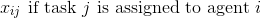
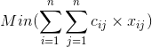
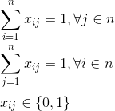
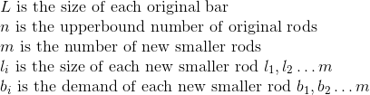
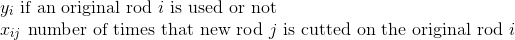
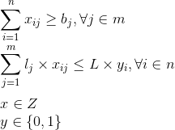
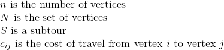
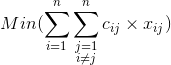
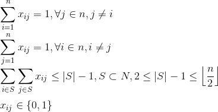

# Julia Optimization Study

# This Repository contains solutions and algorithms for many problems.

Contents
1. [Assignment Problem](#assignment)
2. [Bin Packing Problem](#binpacking)
3. [Connected Components](#connectedcomponents)
4. [Cutting Stock Problem](#cuttingstock)
5. [Knapsack Problem](#knapsack)
6. [Longest Common Subsequence](#LCS)
7. [Minimum Spanning Tree](#MST)
8. [Single Shortest Path](#SSP)
9. [Subset Sum](#subsetsum)
10. [Travelling Salesman Problem](#TSP)

<!-- ######### ASSIGNMENT ######### -->

## Assignment Problem 

Given a set of tasks and a set of agents, given costs for each agent to perform each task.  It is required to perform all tasks by assigning exactly one agent to each task and exactly one task to each agent in such a way that the total cost of the assignment is minimized.

**Solutions**

* Mixed Integer Programming

<h3>Formulation</h3>

<h4>Constants:</h4>

 

<h4>Variables</h4>

 

<h4>Objective:</h4>

 

<h4>s.t.:</h4>

 

<!-- ######### BIN PACKING PROBLEM ######### -->

## Bin Packing Problem

Given a set of itens with different weights, assign each item to a bin such that number of total used bins is minimized. It is assumed that all itens have weights smaller than capacity.

**Solutions**

* Mixed Integer Programming

<h3>Formulation</h3>

<h4>Constants:</h4>

 
 

<h4>Variables</h4>
 
 

<h4>Objective:</h4>
 

<h4>s.t.:</h4>
 
 

<!-- ######### CONNECTED COMPONENTS ######### -->

## Connected Components

Given an undirected graph, print all connected components.

**Solutions**
* Depth First Search (DFS)
* Breadth First Search (BFS)

<!-- ######### CUTTING STOCK PROBLEM ######### -->

## Cutting Stock Problem

Given a upperbound number of original rods, the number of new smaller rods, the size and the demand for each new rod. Determine the minimum number of original rods must be cutted to generate all demanded new rods.

**Solutions**

* Mixed Integer Programming

<h3>Formulation</h3>

<h4>Constants:</h4>

 

<h4>Variables</h4>

 

<h4>Objective:</h4>

 

<h4>s.t.:</h4>

 

<!-- ######### KNAPSACK PROBLEM ######### -->

## Knapsack Problem

Given a set of itens with different values and weights, determine which itens to include in a colection that total weight of itens is less than or equal to a given limit and the total value is higher as possible.

**Solutions**
* Greedy (Not Optimal)
* Dynamic Programming
* Mixed Integer Programming

<h3>Formulation</h3>

<h4>Constants:</h4>

 
 
 

<h4>Variables</h4>
 

<h4>Objective:</h4>
 

<h4>s.t.:</h4>
 
 

<!-- ######### LONGEST COMMON SUBSEQUENCE PROBLEM ######### -->

## Longest Common Subsequence

Given two sequences, find the length of longest subsequence present in both of them. A subsequence is a sequence that appears in the same relative order, but not necessarily contiguous.

**Solutions**
* Brute Force (Recursion)
* Dynamic Programming

<!-- ######### MINIMUM SPANNING TREE PROBLEM ######### -->

## Minimum Spanning Tree

A minimum spanning tree (MST) is a subset of the edges of a connected, edge-weighted undirected graph that connects all the vertices together, without any cycles and with the minimum possible total edge weight.

**Solutions**
* Kruskal's Algorithm
* Prim's Algorithm

<!-- ######### SINGLE SHORTEST PATH PROBLEM ######### -->

## Single Shortest Path

Given a graph and a source vertex in the graph, find shortest paths from source to all vertices in the given graph.

**Solutions**
* Bellman-Ford's Algorithm

<!-- ######### SUBSET SUM PROBLEM ######### -->

##Subset Sum

Given a set of non-negative integers, and a value, determine if there is a subset of the given set with sum equal to given value.

**Solutions**
* Brute Force (Recursion)
* Dynamic Programming

<!-- ######### TRAVELLING SALESMAN PROBLEM ######### -->

## Travelling Salesman Problem

Given a set of cities and distance between every pair of cities, the problem is to find the shortest possible route that visits every city exactly once and returns to the starting point.

* Mixed Integer Programming

<h3>Formulation</h3>

<h4>Constants:</h4>

 

<h4>Variables</h4>
 

<h4>Objective:</h4>
 

<h4>s.t.:</h4>
