# Julia Optimization Study

**It is a study guide for people who are interested in learning Mixed Integer Programming. The repository contains a set of classical optimization problems, and each problem has it is a mathematical formulation and implementation using Julia language with JuMP framework.**

Contents
1. [Assignment Problem](#assignment)
2. [Bin Packing Problem](#binpacking)
3. [Cutting Stock Problem](#cuttingstock)
4. [Facility Location Problem](#facilitylocation)
5. [Knapsack Problem](#knapsack)
6. [Set Partitioning Problem](#SP)
7. [Travelling Salesman Problem](#TSP)

<!-- ######### ASSIGNMENT ######### -->

## Assignment Problem 

Given a set of tasks, a set of agents, and the costs of each agent to perform each task. The problem consists of assigning agents to tasks such that the total cost is minimized.

<h3>Formulation</h3>

<h4>Data:</h4>

$n$ is the number of agents and tasks

$c_{ij}$ is the cost of agent $i$ perform task $j$

<h4>Decision Variables:</h4>

$x_{ij}$ if task $j$ is assigned to agent $i$

<h4>Objective Function:</h4>

$$ Min \left( \sum_{i=1}^{n}\sum_{j=1}^{n} c_{ij}x_{ij} \right) $$

<h4>s.t.:</h4>

$$ \sum_{i=1}^{n} x_{ij} = 1 \qquad i \\, \in \\, n $$

$$ \sum_{i=1}^{n} x_{ij} = 1 \qquad j \\,\in \\, n $$

$$ x_{ij} \\, \in \\, \\{ 0, 1 \\} $$

<!-- ######### BIN PACKING PROBLEM ######### -->

## Bin Packing Problem

The problem is packing a set of items into a minimum number of bins such that the total weight does not exceed the bin's capacities.

<h3>Formulation</h3>

<h4>Data:</h4>

$W$ is the capacity of the bins

$w_{j}$ is the weight of item $j$

<h4>Decision Variables</h4>

$y_{i}$ is a decision variable, if the bin $i$ is used or not

$x_{ij}$ is a decision variable, if the item $j$ is assigned to bin $i$ or not

<h4>Objective Function:</h4>

$$ Min \left( \sum_{i=1}^{n}y_{i} \right) $$

<h4>s.t.:</h4>

$$ \sum_{i=1}^{n} x_{ij} = 1 \qquad i \\, \in \\, n $$

$$ \sum_{j=1}^{n} w_{j} x_{ij} \leq W y_{i} \qquad i \\, \in \\, n $$

$$ x_{ij} \\,\in \\, \\{ 0, 1 \\} $$

$$ y_{i} \\,\in \\, \\{ 0, 1 \\} $$

<!-- ######### CUTTING STOCK PROBLEM ######### -->

## Cutting Stock Problem

Given a length and number of original rods, and given a set of lengths and demands of new smaller rods. Determine the minimum number of original rods that must be cut to generate all demanded new rods.

<h3>Formulation</h3>

<h4>Data:</h4>

$L$ is the size of each original bar

$n$ is the upper bound of original rods

$m$ is the number of new smaller rods

$l_{i}$ is the size of each new smaller rod $l_{1}$, $l_{2}$, ..., $l_{m}$

$b_{i}$ is the demand of each new smaller rod $b_{1}$, $b_{2}$, ..., $b_{m}$

<h4>Decision Variables</h4>

$y_{i}$ if an original rod $i$ is used or not

$x_{ij}$ is the number of times that a new rod $j$ is cut in the original rod $i$

<h4>Objective Function:</h4>

$$ Min \left( \sum_{i=1}^{n}y_{i} \right) $$

<h4>s.t.:</h4>

$$ \sum_{i=1}^{n} x_{ij} \geq b_{j} \qquad j \\, \in \\, m $$

$$ \sum_{j=1}^{m} l_{j} x_{ij} \leq Ly_{i} \qquad i \\, \in \\, n $$

$$ x_{ij} \\, \in \\, Z $$

$$ y_{i} \\,\in \\, \\{ 0, 1 \\} $$

<!-- ######### FACILITY LOCATION PROBLEM ######### -->

## Facility Location Problem

Given a set of clients, a set of potential facilities sites, the costs of building each facility, and the costs of assign each client to each possible facility. The problem consists of deciding which places to build facilities to supply the client's demands such that total costs are minimized.

<h3>Formulation</h3>

<h4>Data:</h4>

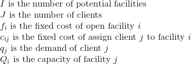 

<h4>Decision Variables</h4>

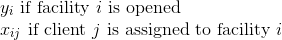 

<h4>Objective Function:</h4>

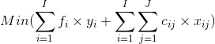 

<h4>s.t.:</h4>

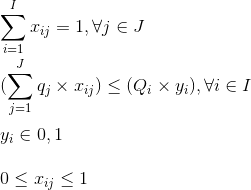 

<!-- ######### KNAPSACK PROBLEM ######### -->

## Knapsack Problem

Given a set of items with different values and weights, determine which items to include in a collection that total weight of items is less than or equal to a given limit, and the total value is higher as possible.

<h3>Formulation</h3>

<h4>Data:</h4>

 
 
 

<h4>Decision Variables</h4>
 

<h4>Objective Function:</h4>
 

<h4>s.t.:</h4>
 
 

<!-- ######### SET PARTITIONING PROBLEM ######### -->

## Set Partitioning Problem

Given a collection of subsets derived from an original set, the problem is to find a partition of the initial set. In other words, the aim is to select a new set of subsets such that the intersection of every subset is empty, and the union of all subsets is equal to the original set.

<h3>Formulation</h3>

<h4>Data:</h4>

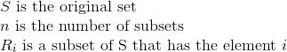 

<h4>Decision Variables</h4>
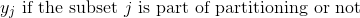 

<h4>Objective Function:</h4>
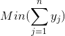 

<h4>s.t.:</h4>
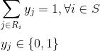

<!-- ######### TRAVELLING SALESMAN PROBLEM ######### -->

## Travelling Salesman Problem

Given a set of cities and the distance between every pair of cities, the problem is to find the shortest possible route that visits every city exactly once and returns to the starting point.

* Mixed Integer Programming - Subtour formulation

<h3>Formulation</h3>

<h4>Data:</h4>

 

<h4>Decision Variables</h4>
 

<h4>Objective Function:</h4>
 

<h4>s.t.:</h4>

* Mixed Integer Programming - Flow Variable

<h3>Formulation</h3>

<h4>Data:</h4>

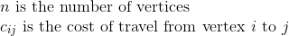 

<h4>Decision Variables</h4>
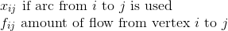 

<h4>Objective Function:</h4>
 

<h4>s.t.:</h4>
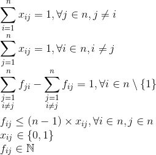
