# Julia Optimisation Study

# This Repository contains solutions and algorithms for many problems.

<h2> Knapsack Problem </h2>

Given a set of itens with different values and weights, determine which itens to include in a colection that total weight of itens is less than or equal to a given limit and the total value is higher as possible.

**Solutions**
* Greedy (Not Optimal)
* Dynamic Programming
* Mixed Integer Programming

<h3>Formulation</h3>

<h4>Constants:</h4>

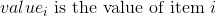 
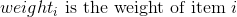 
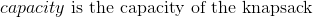 

<h4>Variables</h4>
 

<h4>Objective:</h4>
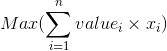 

<h4>s.t.:</h4>
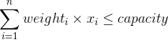 
 

<h2> Bin Packing Problem </h2>

Given a set of itens with different weights, assign each item to a bin such that number of total used bins is minimized. It is assumed that all itens have weights smaller than capacity.

**Solutions**

* Mixed Integer Programming

<h3>Formulation</h3>

<h4>Constants:</h4>

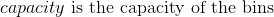 
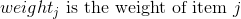 

<h4>Variables</h4>
 
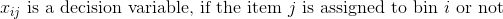 

<h4>Objective:</h4>
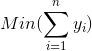 

<h4>s.t.:</h4>
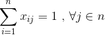 
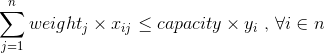 

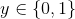

<h2>Subset Sum</h2>

Given a set of non-negative integers, and a value, determine if there is a subset of the given set with sum equal to given value.

**Solutions**
* Brute Force (Recursion)
* Dynamic Programming

<h2> Connected Components </h2>

Given an undirected graph, print all connected components.

**Solutions**
* Depth First Search (DFS)
* Breadth First Search (BFS)

This math is inline $`a^2+b^2=c^2`$.
